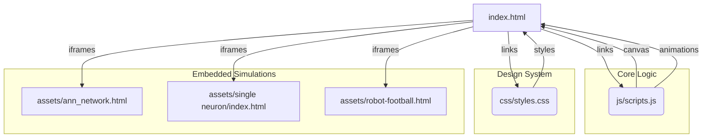

# Graph Report - /Users/mosesmathew/Desktop/Personal/ANN_presentation/code_yt_gemini/ann  (2026-04-21)

## 0. Visual Dependency Graph

## Corpus Check
- 6 files · ~622,871 words
- Verdict: corpus is large enough that graph structure adds value.

## Summary
- 125 nodes · 266 edges · 11 communities detected
- Extraction: 83% EXTRACTED · 17% INFERRED · 0% AMBIGUOUS · INFERRED: 44 edges (avg confidence: 0.8)
- Token cost: 0 input · 0 output

## Community Hubs (Navigation)
- [[_COMMUNITY_Community 0|Community 0]]
- [[_COMMUNITY_Community 1|Community 1]]
- [[_COMMUNITY_Community 2|Community 2]]
- [[_COMMUNITY_Community 3|Community 3]]
- [[_COMMUNITY_Community 4|Community 4]]
- [[_COMMUNITY_Community 5|Community 5]]
- [[_COMMUNITY_Community 6|Community 6]]
- [[_COMMUNITY_Community 7|Community 7]]
- [[_COMMUNITY_Community 8|Community 8]]
- [[_COMMUNITY_Community 9|Community 9]]
- [[_COMMUNITY_Community 10|Community 10]]

## God Nodes (most connected - your core abstractions)
1. `useTime()` - 22 edges
2. `clamp()` - 15 edges
3. `animate()` - 15 edges
4. `drawBrain()` - 9 edges
5. `setGpuStatus()` - 7 edges
6. `gpuCycleOperation()` - 6 edges
7. `resetSideDemo()` - 6 edges
8. `finishCPU()` - 6 edges
9. `saveSlideState()` - 6 edges
10. `cpuTickOperation()` - 5 edges

## Surprising Connections (you probably didn't know these)
- `NeuronBody()` --calls--> `clamp()`  [INFERRED]
  /Users/mosesmathew/Desktop/Personal/ANN_presentation/code_yt_gemini/ann/assets/ann animation/scenes.jsx → /Users/mosesmathew/Desktop/Personal/ANN_presentation/code_yt_gemini/ann/assets/ann animation/animations.jsx
- `OutputLine()` --calls--> `clamp()`  [INFERRED]
  /Users/mosesmathew/Desktop/Personal/ANN_presentation/code_yt_gemini/ann/assets/ann animation/scenes.jsx → /Users/mosesmathew/Desktop/Personal/ANN_presentation/code_yt_gemini/ann/assets/ann animation/animations.jsx
- `FormulaPanel()` --calls--> `clamp()`  [INFERRED]
  /Users/mosesmathew/Desktop/Personal/ANN_presentation/code_yt_gemini/ann/assets/ann animation/scenes.jsx → /Users/mosesmathew/Desktop/Personal/ANN_presentation/code_yt_gemini/ann/assets/ann animation/animations.jsx
- `OutputPulse()` --calls--> `clamp()`  [INFERRED]
  /Users/mosesmathew/Desktop/Personal/ANN_presentation/code_yt_gemini/ann/assets/ann animation/scenes.jsx → /Users/mosesmathew/Desktop/Personal/ANN_presentation/code_yt_gemini/ann/assets/ann animation/animations.jsx
- `StageLabels()` --calls--> `clamp()`  [INFERRED]
  /Users/mosesmathew/Desktop/Personal/ANN_presentation/code_yt_gemini/ann/assets/ann animation/scenes.jsx → /Users/mosesmathew/Desktop/Personal/ANN_presentation/code_yt_gemini/ann/assets/ann animation/animations.jsx

## Communities

### Community 0 - "Community 0"
Cohesion: 0.09
Nodes (7): buildBrain(), closePillPopup(), initGpuDemo(), openGpuDemo(), openPillPopup(), openS3CardPopup(), resizeBrain()

### Community 1 - "Community 1"
Cohesion: 0.21
Nodes (16): closeGpuDemo(), cpuTickOperation(), finishCPU(), gpuCycleOperation(), lightGpuCores(), markGpuBlocks(), resetGpuDemo(), resetSideDemo() (+8 more)

### Community 2 - "Community 2"
Cohesion: 0.3
Nodes (13): clamp(), IconButton(), ImageSprite(), interpolate(), PlaybackBar(), RectSprite(), Sprite(), Stage() (+5 more)

### Community 3 - "Community 3"
Cohesion: 0.17
Nodes (12): drawBall(), drawBrain(), drawNeural(), drawNexus(), drawStorm(), drawStream(), drawSynapse(), initBall() (+4 more)

### Community 4 - "Community 4"
Cohesion: 0.23
Nodes (9): NetworkScene(), BiasPulse(), InputNodes(), lerpPoint(), NavLinks(), NeuronScene(), TweaksPanel(), usePaletteVersion() (+1 more)

### Community 5 - "Community 5"
Cohesion: 0.33
Nodes (10): useTime(), NetCaption(), NetConnections(), netHashedWeight(), NetInputValues(), NetLayerLabels(), NetNodes(), NetOutputValues() (+2 more)

### Community 6 - "Community 6"
Cohesion: 0.33
Nodes (9): getActiveSlides(), goToSlide(), renderQuickNav(), reorderSlides(), saveSlideState(), syncSlider(), toggleHideInactive(), toggleSlideVisibility() (+1 more)

### Community 7 - "Community 7"
Cohesion: 0.29
Nodes (6): Connections(), InputPulses(), NeuronBody(), OutputLine(), TimestampLabel(), TitleCard()

### Community 8 - "Community 8"
Cohesion: 0.33
Nodes (6): applyAccentVars(), setAccent(), setMode(), setPalette(), setStyle(), toggleMode()

### Community 9 - "Community 9"
Cohesion: 0.33
Nodes (6): animate(), BiasNode(), FormulaPanel(), OutputNode(), OutputPulse(), StageLabels()

### Community 10 - "Community 10"
Cohesion: 0.4
Nodes (5): drawAnn(), drawDual(), hexToRgba(), initAnn(), initDual()

## Suggested Questions
_Questions this graph is uniquely positioned to answer:_

- **Why does `useTime()` connect `Community 5` to `Community 9`, `Community 2`, `Community 4`, `Community 7`?**
  _High betweenness centrality (0.048) - this node is a cross-community bridge._
- **Why does `clamp()` connect `Community 2` to `Community 9`, `Community 4`, `Community 5`, `Community 7`?**
  _High betweenness centrality (0.023) - this node is a cross-community bridge._
- **Why does `animate()` connect `Community 9` to `Community 2`, `Community 4`, `Community 5`, `Community 7`?**
  _High betweenness centrality (0.018) - this node is a cross-community bridge._
- **Are the 20 inferred relationships involving `useTime()` (e.g. with `NeuronBody()` and `InputNodes()`) actually correct?**
  _`useTime()` has 20 INFERRED edges - model-reasoned connections that need verification._
- **Are the 9 inferred relationships involving `clamp()` (e.g. with `NeuronBody()` and `OutputLine()`) actually correct?**
  _`clamp()` has 9 INFERRED edges - model-reasoned connections that need verification._
- **Are the 13 inferred relationships involving `animate()` (e.g. with `NeuronBody()` and `OutputLine()`) actually correct?**
  _`animate()` has 13 INFERRED edges - model-reasoned connections that need verification._
- **Should `Community 0` be split into smaller, more focused modules?**
  _Cohesion score 0.09 - nodes in this community are weakly interconnected._